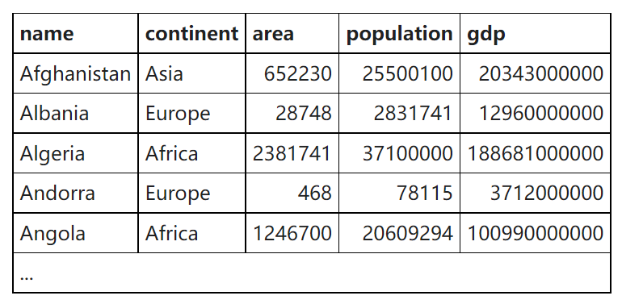
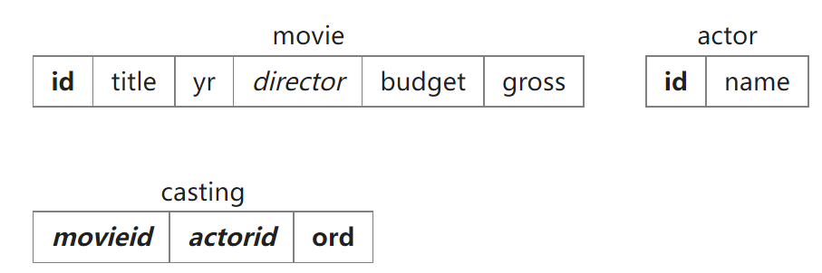

## SELECT within SELECT Tutorial



[SELECT within SELECT Tutorial](https://sqlzoo.net/wiki/SELECT_within_SELECT_Tutorial)

1. List each country name where the population is larger than that of 'Russia'.

  找出人口比俄罗斯多的欧洲国家.

  1.   找出俄罗斯的人口记为 x.
  2.   找出人口 > x 的国家.

  ```sql
  SELECT NAME
  FROM   world
  WHERE  population > (SELECT population
                       FROM   world
                       WHERE  NAME = 'Russia'); 
  ```

2. Show the countries in Europe with a per capita GDP greater than 'United Kingdom'.

  找出人均 GDP 大于英国的欧洲国家.

  1.   计算出英国的人均 GDP, 记为 x.
  2.   找出人均 GDP > x 的欧洲国家.

  ```sql
  SELECT name 
  FROM world
  WHERE continent = 'Europe'
    AND gdp/population > (SELECT gdp/population 
                          FROM world 
                          WHERE name = 'United Kingdom');
  ```

3. List the name and continent of countries in the continents containing either Argentina or Australia. Order by name of the country.

  找出包含阿根廷和澳大利亚的大陆以及其上的所有国家的名称, 结果按照国家名排列.

  1.   找出包含阿根廷和澳大利亚的大陆记为 x
  2.   找出大陆 in x 的大陆和其上所有国家的名称, 按国家名排列.

  ```sql
  SELECT name, continent
  FROM world
  WHERE continent IN (SELECT continent 
                      FROM world
                      WHERE name IN ('Argentina ', 'Australia' ))
  ORDER BY name;
  ```

4. Which country has a population that is more than United Kingdom but less than Germany? Show the name and the population.

  ```sql
  SELECT name, population
  FROM world
  WHERE population > (SELECT population 
                      FROM world 
                      WHERE name = 'United Kingdom') 
    AND population < (SELECT population 
                      FROM world 
                      WHERE name = 'Germany');
  ```

5. Show the name and the population of each country in Europe. Show the population as a percentage of the population of Germany.

  The format should be *Name, Percentage* for example:

  | name    | percentage |
  | ------- | ---------- |
  | Albania | 3%         |
  | Andorra | 0%         |
  | Austria | 11%        |
  | ...     | ...        |

  Decimal places

  Percent symbol %

  You can use the function [CONCAT](https://sqlzoo.net/wiki/CONCAT) to add the percentage symbol.

  没想到嵌套查询不光可以用在 where clause 中, 还可以用在 select 上.

  ```sql
  SELECT name, 
    CONCAT(ROUND(100 * population/(SELECT 
                                   population 
                                   FROM world 
                                   WHERE name='Germany')), '%') as Percentage 
  FROM world
  WHERE continent='Europe'
  ORDER BY name;
  ```

  

6. Which countries have a GDP greater than every country in Europe? [Give the name only.] (Some countries may have NULL gdp values)

  ```sql
  SELECT name 
  FROM world 
  WHERE continent <> 'Europe' 
    and gdp > (SELECT max(gdp) 
               FROM world 
               WHERE continent='Europe')
  ```

  也可以用 ALL 来实现.

  ```sql
  SELECT name FROM world WHERE continent !='Europe' and gdp >=
  ALL(SELECT gdp FROM world WHERE continent='Europe' AND gdp > 0)
  ```

  注: 由于 GDP 的值可能为 NULL, 无法比较, 所以这种写法要在子查询中限制一下.

  大于 `All`(子查询的结果) 等价于大于其中的最大值结果才会进入到外层. 类似地, 大于 `SOME`/`ANY`(子查询的结果) 表示只要大于其中的任意一个就返回结果.

7. Find the largest country (by area) in each continent, show the continent, the name and the area:

  ```sql
  SELECT continent, name, area
  FROM world x
  WHERE area >= ALL(SELECT area
                    FROM world y
                    WHERE x.continent=y.continent 
                      AND area > 0)
  ```

  ```sql
  SELECT continent, name, area 
  FROM world
  WHERE area IN (SELECT MAX(area) 
                 FROM world 
                 GROUP BY continent)
  ```

  GROUP BY 之外的字段还有 name 不在聚合函数中, 所以不能简化, 而需要用嵌套查询.

8. List each continent and the name of the country that comes first alphabetically.

  ```sql
  SELECT continent, name
  FROM world x
  WHERE name <= ALL(SELECT name 
                    FROM world y 
                    WHERE x.continent=y.continent)
  ```

  字符串的字典顺序可以直接用比较运算符比较. 所以同 area 也一样.

  ```sql
  SELECT continent, name
  FROM world
  WHERE name IN (SELECT MIN(name) 
                 FROM world 
                 GROUP BY continent)
  ```

  ```sql
  SELECT continent, min(name) FROM world GROUP BY continent;
  ```

  因为 GROUP BY 之外的字段只有 name, 而且 name 在聚合函数中. 所以可以如上简化.

9. Find the continents where all countries have a population <= 25000000. Then find the names of the countries associated with these continents. Show name, continent and population.

  ```sql
  SELECT name, continent, population
  FROM world
  WHERE continent IN (SELECT continent 
                      FROM world 
                      GROUP BY continent HAVING MAX(population) <= 25000000)
  ```

  ```sql
  SELECT name, continent, population
  FROM world x
  WHERE 25000000 >= ALL(SELECT population 
                        FROM world y 
                        WHERE x.continent=y.continent 
                          AND y.population > 0)
  ```

10. Some countries have populations more than three times that of all of their neighbors (in the same continent). Give the countries and continents.

  ```sql
  SELECT name, continent
  FROM world x
  WHERE population >= ALL(SELECT population *3 
  												FROM world y
  												WHERE x.continent = y.continent 
                            AND x.name <> y.name);
  ```

### Tips

*   嵌套语句不光能用在 where 子句, 也可以用在 select 处.
*   可以对外层的 select 起个别名, 然后在内层中通过该别名来引用外层结果的字段.
*   ALL, ANY/SOME 关键字在子查询上的使用. 
*   一些情况下, 可以用 GROUP BY 简化嵌套查询

## The JOIN operation


| id   | mdate        | stadium                   | team1 | team2 |
| :--- | :----------- | :------------------------ | :---- | :---- |
| 1001 | 8 June 2012  | National Stadium, Warsaw  | POL   | GRE   |
| 1002 | 8 June 2012  | Stadion Miejski (Wroclaw) | RUS   | CZE   |
| 1003 | 12 June 2012 | Stadion Miejski (Wroclaw) | GRE   | CZE   |
| 1004 | 12 June 2012 | National Stadium, Warsaw  | POL   | RUS   |
| ...  |              |                           |       |       |


| matchid | teamid | player               | gtime |
| :------ | :----- | :------------------- | :---- |
| 1001    | POL    | Robert Lewandowski   | 17    |
| 1001    | GRE    | Dimitris Salpingidis | 51    |
| 1002    | RUS    | Alan Dzagoev         | 15    |
| 1002    | RUS    | Roman Pavlyuchenko   | 82    |
| ...     |        |                      |       |


| id   | teamname       | coach            |
| :--- | :------------- | :--------------- |
| POL  | Poland         | Franciszek Smuda |
| RUS  | Russia         | Dick Advocaat    |
| CZE  | Czech Republic | Michal Bilek     |
| GRE  | Greece         | Fernando Santos  |
| ...  |                |                  |

[The JOIN operation](https://sqlzoo.net/wiki/The_JOIN_operation)

1.   The first example shows the goal scored by a player with the last name 'Bender'. The `*` says to list all the columns in the table - a shorter way of saying `matchid, teamid, player, gtime`.

     Modify it to show the `matchid` and *player* name for all goals scored by Germany. To identify German players, check for: `teamid = 'GER'`

     ```sql
     SELECT matchid, player
     FROM goal
     WHERE teamid='GER';
     ```

2.   **Show id, stadium, team1, team2 for just game 1012**

     ```sql
     SELECT id,stadium,team1,team2
     FROM game
     WHERE id = 1012;
     ```

     

3.   **Show the player, teamid, stadium and mdate for every German goal.**

     ```sql
     SELECT player,teamid,stadium,mdate
     FROM game 
     JOIN goal ON (game.id=goal.matchid)
     WHERE goal.teamid='GER';
     ```

4.   **Show the team1, team2 and player for every goal scored by a player called Mario** `player LIKE 'Mario%'`

     ```sql
     SELECT team1,team2,player 
     FROM game
     JOIN goal ON game.id=goal.matchid
     WHERE goal.player LIKE 'Mario%'
     ```

5.   **Show** `player`**,** `teamid`**,** `coach`**,** `gtime` **for all goals scored in the first 10 minutes** `gtime<=10`

     ```sql
     SELECT player, teamid, coach, gtime
     FROM goal
     JOIN eteam ON goal.teamid=eteam.id
     WHERE gtime<=10
     ```

6.   **List the dates of the matches and the name of the team in which 'Fernando Santos' was the team1 coach.**

     ```sql
     SELECT mdate, teamname
     FROM game
     JOIN eteam ON game.team1=eteam.id
     WHERE eteam.coach='Fernando Santos'
     ```

7.   **List the player for every goal scored in a game where the stadium was 'National Stadium,** Warsaw**'**

     ```sql
     SELECT player
     FROM game
     JOIN goal ON game.id=goal.matchid
     WHERE stadium='National Stadium, Warsaw'
     ```

8.   TODO

9.   **Show** **teamname** **and the total number of goals scored.**

     列出每个队伍的名称以及相应的总进球数.

     ```sql
     SELECT teamname, COUNT(teamid) as goals
     FROM eteam
     JOIN goal ON id=teamid
     GROUP BY teamname
     ```

10.   **Show the stadium and the number of goals scored in each stadium.**

     ```sql
     SELECT stadium, COUNT(id)
     FROM game
     JOIN goal ON id=matchid
     GROUP BY stadium
     ```

11.   **For every match involving '**POL**', show the matchid, date and the number of goals scored.**

      ```sql
      SELECT matchid, mdate, COUNT(*) as goals
      FROM game
      JOIN goal ON id=matchid
      WHERE team1='POL' OR team2='POL'
      GROUP BY matchid, mdate;
      ```

      按照 `matchid`, `mdate` 两个字段的组合来 group, 以保证在有 group by 的情况下能够 select 出这两个字段. 因为都是一场比赛里的两个数据, 所以不会有问题. 

12.   **For every match where 'GER' scored, show matchid, match date and the number of goals scored by 'GER'**

      ```sql
      SELECT matchid, mdate, COUNT(matchid) as goals
      FROM game
      JOIN goal ON id=matchid
      WHERE teamid='GER'
      GROUP BY matchid,mdate
      ```

13.   

### Tips

*   join 是两个表 merge 后的结果, 相当于结果集是两个表的字段组合成一个新的大表. 但是也要告诉数据库两张表的对应关系, 也就是 ON 关键字, 用一张表的一个字段匹配另一张表的一个字段. 一般都是 id.
*   小表驱动大表 ( TODO: why )

## More JOIN operations



[More JOIN operations](https://sqlzoo.net/wiki/More_JOIN_operations)

*   casting 是级联表. 用于关联 movie 和 actor 这两张表.
*   `ord` 是 order 的缩写, 即角色顺序 ( 第一主角, 第二主角等 )

1.   List the films where the **yr** is 1962 [Show **id**, **title**]

     ```sql
     SELECT id, title
     FROM movie
     WHERE yr=1962
     ```

     

2.   Give year of 'Citizen Kane'.

     ```sql
     SELECT yr
     FROM movie
     WHERE title='Citizen Kane'
     ```

     

3.   List all of the Star Trek movies, include the **id**, **title** and **yr** (all of these movies include the words Star Trek in the title). Order results by year.

     ```sql
     SELECT id, title, yr
     FROM movie
     WHERE title LIKE '%Star Trek%'
     ORDER BY yr
     ```

     

4.   What **id** number does the actor 'Glenn Close' have?

     ```sql
     SELECT id
     FROM actor
     WHERE name = 'Glenn Close';
     ```

     

5.   What is the **id** of the film 'Casablanca'

     ```sql
     SELECT id
     FROM movie
     WHERE title='Casablanca';
     ```

     

6.   Obtain the cast list for 'Casablanca'

     what is a cast list?

     The cast list is the names of the actors who were in the movie.

     ```sql
     SELECT a.name
     FROM movie m
     JOIN casting c ON (m.id=c.movieid)
     JOIN actor a ON (a.id=c.actorid)
     WHERE title='Casablanca';
     ```

7.   Obtain the cast list for the film 'Alien'

     ```sql
     SELECT a.name
     FROM movie m
     JOIN casting c ON (m.id=c.movieid)
     JOIN actor a ON (a.id=c.actorid)
     WHERE title='Alien';
     ```

8.   List the films in which 'Harrison Ford' has appeared

     ```sql
     SELECT m.title
     FROM movie m
     JOIN casting c ON (m.id=c.movieid)
     JOIN actor a ON (a.id=c.actorid)
     WHERE a.name='Harrison Ford';
     ```

9.   List the films where 'Harrison Ford' has appeared - but not in the starring role. [Note: the **ord** field of casting gives the position of the actor. If ord=1 then this actor is in the starring role]

     ```sql
     SELECT m.title
     FROM movie m
     JOIN casting c ON (m.id=c.movieid)
     JOIN actor a ON (a.id=c.actorid)
     WHERE a.name='Harrison Ford'
       AND c.ord<>1;
     ```

10.   List the films together with the leading star for all 1962 films.

      ```sql
      SELECT m.title, a.name
      FROM movie m
      JOIN casting c ON (m.id=c.movieid)
      JOIN actor a ON (a.id=c.actorid)
      WHERE m.yr=1962 AND c.ord=1;
      ```

11.   Which were the busiest years for 'Rock Hudson', show the year and the number of movies he made each year for any year in which he made more than 2 movies.

      ```sql
      SELECT m.yr, COUNT(m.id)
      FROM movie m
      JOIN casting c ON (m.id=c.movieid)
      JOIN actor a ON (a.id=c.actorid)
      WHERE a.name = 'Rock Hudson'
      GROUP BY m.yr
      HAVING COUNT(m.id) > 2
      ```

12.   List the film title and the leading actor for all of the films 'Julie Andrews' played in.

      先找到 Julie Andrews 参演的所有电影的 id, 再用 IN 来找到所需要的全部字段.

      ```sql
      SELECT 
        m.title, a.name
      FROM 
        movie m
        JOIN casting c ON (c.movieid = m.id)
        JOIN actor a ON (c.actorid = a.id)
      WHERE 
        c.ord = 1 
        AND m.id IN (
          SELECT 
            movieid
          FROM 
            actor
            JOIN casting ON (actor.id=casting.actorid)
          WHERE name = 'Julie Andrews'
        )
      ```

13.   Obtain a list, in alphabetical order, of actors who've had at least 15 **starring** roles.

      注: 答案和题目有些不符, 题目要求按照字典顺序, 但是答案不排序.

      ```sql
      SELECT a.name
      FROM actor a
      JOIN casting c ON (a.id = c.actorid)
      WHERE c.ord = 1
      GROUP BY a.name
      HAVING COUNT(c.movieid) >= 15
      ```

14.   List the films released in the year 1978 ordered by the number of actors in the cast, then by title.

      ```sql
      SELECT m.title, COUNT(actorid)
      FROM movie m
      JOIN casting c ON (m.id = c.movieid)
      JOIN actor a ON (c.actorid = a.id)
      WHERE m.yr = 1978
      GROUP BY m.id, m.title
      ORDER BY COUNT(c.actorid) DESC, title
      ```

      *   GROUP BY m.id, m.title 这个 CLAUSE, 其实, group by m.id 就够了, 但是要求查询 title, 就按照 id 和 title 这个组合一起查询了

15.   List all the people who have worked with 'Art Garfunkel'.

      *   先找出 'Art Garfunkel' 参演的所有电影的 movieid
      *   再用 IN 来找出所需要的字段.

      ```sql
      SELECT 
        a.name 
      FROM 
        actor a 
        JOIN casting c ON (c.actorid = a.id) 
        JOIN movie m ON (c.movieid = m.id) 
      WHERE 
        a.name <> 'Art Garfunkel' 
        AND m.id IN (
          SELECT 
            movieid 
          FROM 
            casting 
            JOIN actor ON (casting.actorid = actor.id) 
          WHERE 
            name = 'Art Garfunkel'
        )
      
      ```